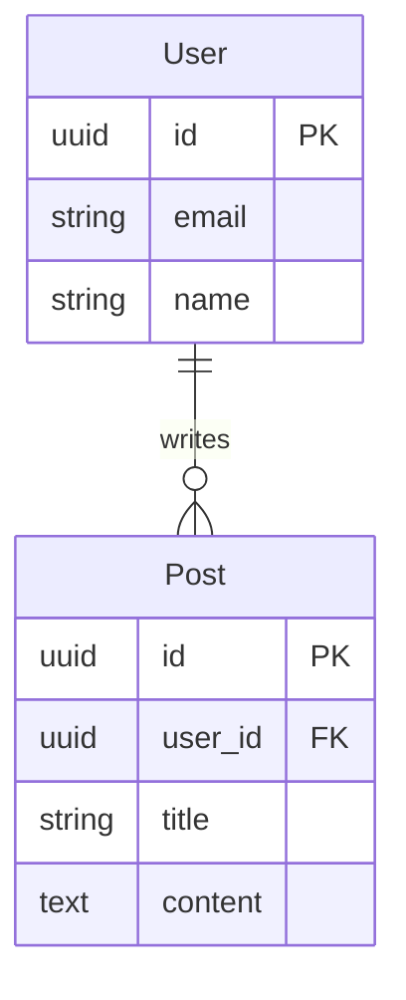

데이터 모델 문서를 작성합니다.

## 개요

시스템의 데이터 구조와 관계를 정의합니다.
이 문서는 구현의 기반이 되며, 변경 시 영향도 분석에 활용됩니다.

## 지시사항

1. 핵심 엔티티를 정의하세요
2. 각 엔티티의 속성을 나열하세요
3. 엔티티 간 관계를 정의하세요
4. ERD를 Mermaid로 작성하세요

## 데이터 모델 템플릿

```markdown
# 데이터 모델: [시스템명]

> 작성일: YYYY-MM-DD
> 버전: 1.0.0

## 엔티티 정의

### User (사용자)

| 필드 | 타입 | 필수 | 설명 |
|------|------|------|------|
| id | UUID | O | 고유 식별자 |
| email | string | O | 이메일 (unique) |
| name | string | O | 사용자명 |
| created_at | datetime | O | 생성일시 |

### Post (게시글)

...

## 관계도 (ERD)



## 인덱스

| 테이블 | 인덱스 | 컬럼 | 유형 |
|--------|--------|------|------|
| User | idx_user_email | email | UNIQUE |

## 제약조건

- User.email은 유일해야 한다(SHALL)
- Post.user_id는 User.id를 참조해야 한다(SHALL)
```

## 저장 위치

데이터 모델은 `.sdd/data-model.md` 또는 해당 기능 디렉토리에 저장하세요.
