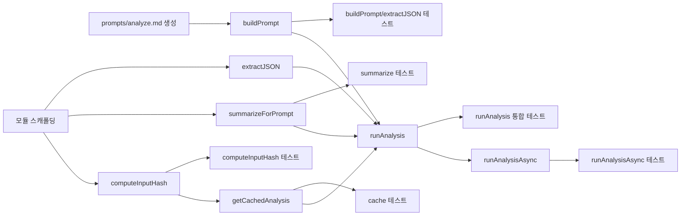

# Tasks: AI 분석 실행 모듈 (ai-analyzer)

## 개요

- 총 작업 수: 14개
- 예상 복잡도: 높음

---

## 작업 목록

### Phase 1: 기반 구축

- [ ] [P1] `prompts/analyze.md` 프롬프트 템플릿 파일 생성 (DESIGN.md 5.2절 기반)
- [ ] [P1] `lib/ai-analyzer.mjs` 모듈 스캐폴딩 (상수, import 설정: `db.mjs`에서 queryEvents/getDb/loadConfig/generateEmbeddings, `feedback-tracker.mjs`에서 getFeedbackSummary, `skill-matcher.mjs`에서 loadSkills)

### Phase 2: 핵심 구현

- [ ] [P2] `computeInputHash()` (internal) 구현 — SHA-256 기반 Content-Addressable 해시 (crypto.createHash), 해시 입력: `events.map(e => \`${e.type}:${e.ts}:${e.session_id}:${JSON.stringify(e.data)}\`).join('\\n')` — 이벤트를 `:` 구분 필드로 결합 후 `\\n`으로 join. JSON.stringify(전체)가 아님 (DESIGN.md L1149-1153), analysis_cache의 input_hash와 비교하여 캐시 히트 판정 (REQ-AA-001)
- [ ] [P2] `summarizeForPrompt()` (internal) 구현 — 로그 요약 (최대 100 프롬프트, 세션별 도구 시퀀스), 반환: `{ prompts: [{prompt, ts}], toolSequences: [{session, tools:[{tool, count}]}], errors: [{tool, error, raw: e.errorRaw}], sessionCount: number, toolTotal: number }`
- [ ] [P2] `buildPrompt()` (internal) 구현 — 템플릿 로드 및 플레이스홀더 치환, 치환 플레이스홀더 5개: `{{days}}`, `{{project}}`, `{{log_data}}` (summarizeForPrompt 결과), `{{feedback_history}}` (getFeedbackSummary() 호출), `{{existing_skills}}` (loadSkills() 호출), `{{outcome_metrics}}`
- [ ] [P2] `extractJSON()` (internal) 구현 — 코드 블록/순수 JSON 추출
- [ ] [P2] `getCachedAnalysis()` (export) 구현 — TTL 기반 캐시 조회, `computeInputHash()` 호출하여 input_hash 비교
- [ ] [P2] `runAnalysis()` (export) 구현 — 동기 `claude --print` 실행 + 캐시 저장, (1) `execSync('claude --print ...', { input: prompt, encoding: 'utf-8', maxBuffer: 10 * 1024 * 1024, timeout: 120000 })` — maxBuffer 10MB, timeout 2분, (2) 캐시 저장: `INSERT INTO analysis_cache ... ON CONFLICT(project, days, input_hash) DO UPDATE SET ts = excluded.ts, analysis = excluded.analysis` UPSERT 패턴
- [ ] [P2] `runAnalysisAsync()` (export) 구현 — detached child_process.spawn 패턴, session-summary에서 호출되는 비동기 백그라운드 실행 (REQ-AA-003)

### Phase 3: 테스트 및 마무리

- [ ] [P3] [→T] `computeInputHash()` 단위 테스트 — 동일 입력 → 동일 해시 시나리오, 다른 입력 → 다른 해시 시나리오
- [ ] [P3] [→T] `summarizeForPrompt()` 단위 테스트
- [ ] [P3] [→T] `buildPrompt()`, `extractJSON()` 단위 테스트
- [ ] [P3] [→T] `getCachedAnalysis()` 단위 테스트 (유효/만료/없음, input_hash 일치/불일치)
- [ ] [P3] [→T] `runAnalysis()` 통합 테스트 (mock claude --print)
- [ ] [P3] [→T] `runAnalysisAsync()` 테스트 — detached 실행 검증, exit 0 확인

---

## 의존성 그래프

---

## 마커 범례

| 마커 | 의미 |
|------|------|
| [P1-3] | 우선순위 |
| [→T] | 테스트 필요 |
| [US] | 불확실/검토 필요 |
