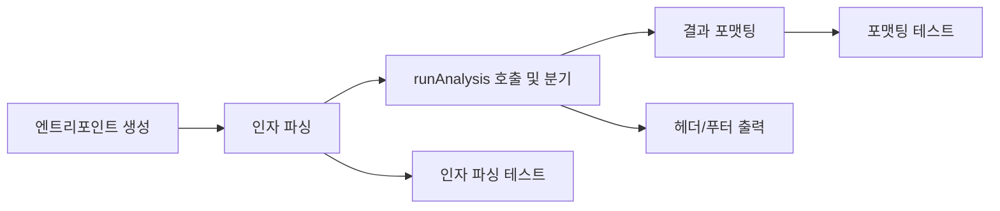

# Tasks: 심층 분석 CLI 도구 (analyze-cli)

## 개요

- 총 작업 수: 7개
- 예상 복잡도: 낮음

---

## 작업 목록

### Phase 1: 기반 구축

- [ ] [P1] `bin/analyze.mjs` 엔트리포인트 파일 생성
- [ ] [P1] `process.argv` 기반 인자 파싱 (`--days`, `--project`, `--project-path`) 구현, 기본값: `days = 30` (CLI 기본), `project = null`, `projectPath = null`. 참고: `runAnalysis()` 내부 기본값은 `days = 7`이지만, CLI에서는 `30`이 기본

### Phase 2: 핵심 구현

- [ ] [P2] `runAnalysis()` 호출 및 결과 분기 처리 (error, insufficient_data, 정상)
- [ ] [P2] 결과 포맷팅 출력 — 클러스터, 워크플로우, 에러 패턴, 제안 4개 섹션
- [ ] [P2] 헤더/푸터 출력 — 분석 기간 헤더, 적용 안내 푸터

### Phase 3: 테스트 및 마무리

- [ ] [P3] [→T] 인자 파싱 단위 테스트 (기본값, 커스텀, 잘못된 입력)
- [ ] [P3] [→T] 결과 포맷팅 단위 테스트 (전체/부분 섹션 출력)

---

## 의존성 그래프

---

## 마커 범례

| 마커 | 의미 |
|------|------|
| [P1-3] | 우선순위 |
| [→T] | 테스트 필요 |
| [US] | 불확실/검토 필요 |
