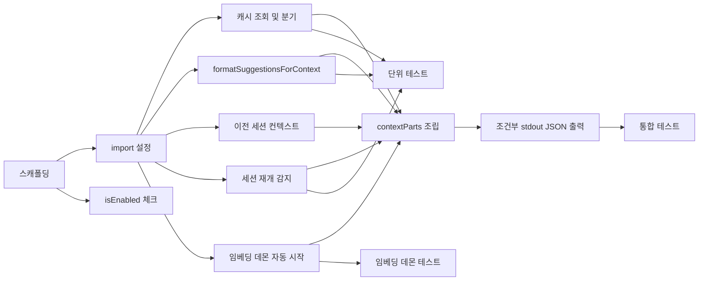

# Tasks: SessionStart 캐시 주입 훅 (session-start-hook)

## 개요

- 총 작업 수: 12개
- 예상 복잡도: 중간

---

## 작업 목록

### Phase 1: 기반 구축

- [ ] [P1] `hooks/session-analyzer.mjs` 훅 스크립트 스캐폴딩 (최상위 try-catch, stdin 읽기)
- [ ] [P1] 의존 모듈 import 설정 (`ai-analyzer.mjs`, `db.mjs`)
- [ ] [P1] `isEnabled()` 체크 로직 구현 — `config.json` 읽기, `enabled: false` 시 exit 0 (REQ-SSH-001)

### Phase 2: 핵심 구현

- [ ] [P2] `getCachedAnalysis(24, project)` 호출 및 suggestions 존재 여부 분기
- [ ] [P2] `formatSuggestionsForContext()` 구현 — 최대 3개 제안 포맷팅
- [ ] [P2] 이전 세션 컨텍스트 조회 — `events` 테이블에서 마지막 session_summary 읽기, (1) 쿼리: `queryEvents({ type: 'session_summary', projectPath: projectDir, limit: 1 })` — **projectPath 필터** 포함, (2) topTools 계산: `Object.entries(prev.toolCounts).sort((a,b) => b[1]-a[1]).slice(0,3)` — 상위 3개 도구 추출
- [ ] [P2] 세션 재개 감지 — `source === 'resume'` 시 `[RESUME]` 태그 + 미해결 에러 주입
- [ ] [P2] 임베딩 데몬 자동 시작 — `isServerRunning()` 확인 → 미실행 시 `startServer()` 호출, try-catch로 실패 무시 (REQ-SSH-006, dynamic import from `../lib/embedding-client.mjs`)
- [ ] [P2] `contextParts` 배열 조립 및 조건부 출력 — 제안 + 이전 세션 컨텍스트를 `contextParts` 배열에 모음, `contextParts.join('\n\n')`으로 결합, `contextParts.length > 0`일 때만 `hookSpecificOutput.additionalContext` 형식으로 stdout JSON 출력, 빈 경우 무출력 + exit 0 (REQ-SSH-007)

### Phase 3: 테스트 및 마무리

- [ ] [P3] [→T] 단위 테스트 — 포맷팅, 캐시 분기, resume 감지, 예외 처리
- [ ] [P3] [→T] 임베딩 데몬 관련 테스트 — 데몬 이미 실행 중 → startServer 미호출, 데몬 미실행 → startServer 호출 성공, startServer 실패 → 무시하고 계속 실행
- [ ] [P3] [→T] 통합 테스트 — 실제 캐시 파일로 훅 실행 → stdout JSON 검증

---

## 의존성 그래프

---

## 마커 범례

| 마커 | 의미 |
|------|------|
| [P1-3] | 우선순위 |
| [→T] | 테스트 필요 |
| [US] | 불확실/검토 필요 |
