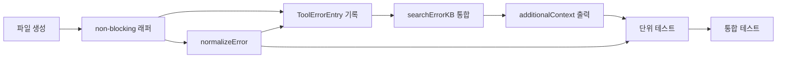

# 작업 목록: error-logger

## 개요

- 총 작업 수: 11개
- 예상 복잡도: 중간

---

## 작업 목록

### Phase 1: 기반 구축

- [ ] [P1] `hooks/error-logger.mjs` 파일 생성 및 db.mjs import 설정
- [ ] [P1] try-catch + `process.exit(0)` non-blocking 래퍼 구조 작성

### Phase 2: 핵심 구현

- [ ] [P2] `isEnabled()` 체크 추가 — 훅 진입점에서 `if (!isEnabled()) process.exit(0)` 호출 (모든 훅 필수 패턴)
- [ ] [P2] ToolErrorEntry 스키마 구성 및 `insertEvent()` 호출 — `v`, `type`, `ts`, `sessionId`, `project`, `projectPath`, `tool`, `error`, `errorRaw` (500자 제한: `(input.error || '').slice(0, 500)`)
- [ ] [P2] `normalizeError()` import — import: `{ normalizeError, searchErrorKB }` from `'../lib/error-kb.mjs'` (단일 소유자 원칙, 구현하지 말고 import만). 입력: `input.error || ''` (DESIGN.md L2334). insertEvent 전에 정규화 수행 순서: (1) normalizeError → (2) insertEvent(정규화된 에러 포함) → (3) searchErrorKB
- [ ] [P2] `searchErrorKB()` 통합 — error-kb.mjs에서 import하여 정규화된 에러로 KB 검색
- [ ] [P2] 2초 타임아웃 적용 — `Promise.race([searchErrorKB(normalized), new Promise(resolve => setTimeout(() => resolve(null), 2000))])` (임베딩 데몬 콜드 스타트 대비)
- [ ] [P2] resolution 텍스트 포매팅 — JSON 파싱하여 `toolSequence.join(' → ')` 표시, 파싱 실패 시 원본 문자열 사용
- [ ] [P2] `additionalContext` stdout 출력 — KB 매칭 시 `hookSpecificOutput` JSON 형식으로 해결 이력 주입

### Phase 3: 마무리

- [ ] [P3] [->T] 단위 테스트 — resolution 텍스트 포매팅 (JSON 파싱 성공/실패), errorRaw 500자 제한
- [ ] [P3] [->T] 통합 테스트 — KB 매칭/미매칭 시 stdout 출력 검증, 2초 타임아웃 검증, KB 오류 시 정상 종료 검증

---

## 의존성 그래프

---

## 마커 범례

| 마커 | 의미 |
|------|------|
| [P1-3] | 우선순위 |
| [->T] | 테스트 필요 |
| [US] | 불확실/검토 필요 |
