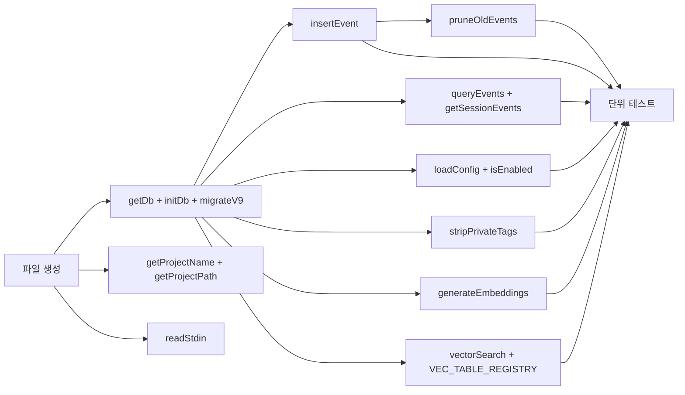

# 작업 목록: log-writer

## 개요

- 총 작업 수: 19개
- 예상 복잡도: 중간

---

## 작업 목록

### Phase 1: 기반 구축

- [ ] [P1] `lib/db.mjs` 파일 생성 및 ES Module 설정
- [ ] [P1] `getDb()` 구현 — SQLite DB 연결 반환 + `data/` 디렉토리 자동 생성 + WAL 모드 설정. 세부사항: (1) `sqliteVec.load(db)` sqlite-vec 확장 로드, (2) `events` 테이블 존재 확인 후 조건부 `initDb(db)` 호출, (3) `migrateV9(db)` 호출, (4) `db.pragma('busy_timeout = 5000')` 설정
- [ ] [P1] `getProjectName(cwd)` 구현 — cwd에서 프로젝트 디렉토리명 추출
- [ ] [P1] `getProjectPath(cwd)` 구현 — CLAUDE_PROJECT_DIR 환경변수 우선, fallback cwd
- [ ] [P1] `readStdin()` 구현 — stdin 비동기 읽기 (Promise 기반, `process.stdin.on('data')` + `on('end')`) + JSON 파싱 + 5초 타임아웃
- [ ] [P1] `initDb(db)` 구현 — 5개 테이블(events, error_kb, analysis_cache, feedback, skill_embeddings) + FTS5(events_fts) + vec0(vec_error_kb, vec_skill_embeddings) + 4개 events 인덱스 (idx_events_session, idx_events_project_type, idx_events_type_ts, idx_events_session_type), 1개 error_kb UNIQUE 인덱스 (idx_error_kb_error), 1개 analysis_cache UNIQUE 인덱스, 3개 TRIGGER (events_fts_insert, events_fts_delete, events_no_update)
- [ ] [P1] `migrateV9(db)` 구현 — input_hash 컬럼 추가, events_fts backfill, 멱등성 보장

### Phase 2: 핵심 구현

- [ ] [P2] `insertEvent(entry)` 구현 — `events` 테이블에 이벤트 INSERT
- [ ] [P2] `queryEvents(filterOrLimit)` 구현 — 필터 조회(type/sessionId/project/projectPath/since/search) + FTS5 검색 지원. 반환값: `rows.map(row => ({ v: row.v, type: row.type, ts: row.ts, sessionId: row.session_id, project: row.project, projectPath: row.project_path, ...JSON.parse(row.data) }))` — flat entry 형식으로 재구성 (data JSON을 최상위로 펼침)
- [ ] [P2] `getSessionEvents(sessionId, limit)` 구현 — 편의 함수
- [ ] [P2] `pruneOldEvents()` 구현 — 확률적 정리 (1% 확률 트리거)
- [ ] [P2] `loadConfig()` 구현 — config.json 로딩 + 기본값 fallback
- [ ] [P2] `isEnabled()` 구현 — loadConfig().enabled 체크
- [ ] [P2] `stripPrivateTags(text)` 구현 — `<private>...</private>` 태그 정규식 제거
- [ ] [P2] `generateEmbeddings(texts)` 구현 — embedding-client.mjs의 embedViaServer() 호출 래퍼, try-catch로 빈 배열 반환
- [ ] [P2] `vectorSearch(table, vecTable, queryEmbedding, limit)` 구현 — VEC_TABLE_REGISTRY 기반 2단계 벡터 검색. 쿼리 임베딩을 `Buffer.from(new Float32Array(queryEmbedding).buffer)`로 변환 후 SQL 바인딩. Step 1: `WHERE embedding MATCH ? AND k = ? ORDER BY distance`, Step 2: 원본 테이블에서 `WHERE id IN (...)` 조회 후 distance merge
- [ ] [P2] `VEC_TABLE_REGISTRY` 상수 정의 — `{ error_kb: { vecTable: 'vec_error_kb', fkColumn: 'error_kb_id' }, skill_embeddings: { vecTable: 'vec_skill_embeddings', fkColumn: 'skill_id' } }`

### Phase 3: 테스트

- [ ] [P3] [->T] 단위 테스트 — insertEvent, queryEvents, getSessionEvents, pruneOldEvents, loadConfig, readStdin, stripPrivateTags 각 함수별
- [ ] [P3] [->T] 벡터 검색 테스트 — vectorSearch, generateEmbeddings (임베딩 데몬 mock)

---

## 의존성 그래프

---

## 마커 범례

| 마커 | 의미 |
|------|------|
| [P1-3] | 우선순위 |
| [->T] | 테스트 필요 |
| [US] | 불확실/검토 필요 |
