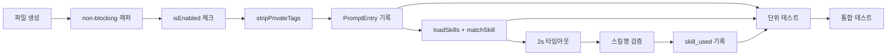

# 작업 목록: prompt-logger

## 개요

- 총 작업 수: 12개
- 예상 복잡도: 중간

---

## 작업 목록

### Phase 1: 기반 구축

- [ ] [P1] `hooks/prompt-logger.mjs` 파일 생성 및 db.mjs import 설정
- [ ] [P1] try-catch + `process.exit(0)` non-blocking 래퍼 구조 작성

### Phase 2: 핵심 구현

- [ ] [P2] `isEnabled()` / `loadConfig()` 체크 구현 — config.enabled === false 시 exit 0
- [ ] [P2] `stripPrivateTags()` 호출 구현 — 프롬프트 텍스트에서 `<private>` 태그 제거
- [ ] [P2] PromptEntry 스키마 구성 및 `insertEvent()` 호출 — `v`, `type`, `ts`, `sessionId`, `project`, `projectPath`, `text`, `charCount`
- [ ] [P2] 프라이버시 모드 구현 — 순서: (1) `loadConfig().collectPromptText === false`이면 `rawPrompt = '[REDACTED]'`, (2) `promptText = stripPrivateTags(rawPrompt)` — REDACTED 이후에도 stripPrivateTags 적용 (DESIGN.md L2706-2711 코드 순서)
- [ ] [P2] `loadSkills()` + `matchSkill()` 스킬 자동 감지 구현 — import: `{ loadSkills, matchSkill }` from `'../lib/skill-matcher.mjs'`, 매칭 시 hookSpecificOutput stdout 출력
- [ ] [P2] 2초 `Promise.race` 타임아웃 구현 — 임베딩 데몬 콜드 스타트 대비, 타임아웃 시 스킬 감지 스킵
- [ ] [P2] 슬래시 커맨드 스킬명 검증 구현 — `skills.some(s => s.name === skillName)` false positive 방지
- [ ] [P2] `skill_used` 이벤트 기록 구현 — 검증된 슬래시 커맨드만 기록. 이벤트 구조: `{ v: 1, type: 'skill_used', ts, sessionId, project, projectPath, skillName: match.name }` — `skillName`은 `data` JSON 내부 필드

### Phase 3: 테스트

- [ ] [P3] [->T] 단위 테스트 — 일반 프롬프트, 프라이버시 모드, 프라이빗 태그 제거, isEnabled false
- [ ] [P3] [->T] 스킬 감지 테스트 — 벡터 매칭, 키워드 폴백, 타임아웃, false positive 방지
- [ ] [P3] 통합 테스트 — stdin mock으로 전체 훅 실행 플로우 검증

---

## 의존성 그래프

---

## 마커 범례

| 마커 | 의미 |
|------|------|
| [P1-3] | 우선순위 |
| [->T] | 테스트 필요 |
| [US] | 불확실/검토 필요 |
