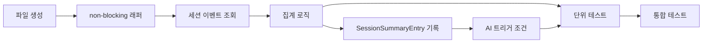

# 작업 목록: session-summary

## 개요

- 총 작업 수: 15개
- 예상 복잡도: 높음 (v7/v8/v9 기능 7개 추가로 복잡도 상승)

---

## 작업 목록

### Phase 1: 기반 구축

- [ ] [P1] `hooks/session-summary.mjs` 파일 생성 및 db.mjs import 설정
- [ ] [P1] try-catch + `process.exit(0)` non-blocking 래퍼 구조 작성

### Phase 2: 핵심 구현

- [ ] [P2] `isEnabled()` 체크 추가 — 훅 진입점에서 `if (!isEnabled()) process.exit(0)` 호출 (모든 훅 필수 패턴)
- [ ] [P2] 세션 이벤트 조회 — `queryEvents({ sessionId })` 로 현재 세션 이벤트 필터링
- [ ] [P2] 기본 집계 로직 구현 — `promptCount`, `toolCounts` (도구별 횟수 객체), `toolSequence` (시간순 도구명 배열), `errorCount`, `uniqueErrors` (Set 기반 중복 제거)
- [ ] [P2] `lastPrompts` 수집 (v7 P2) — 마지막 3개 프롬프트의 앞 100자: `prompts.slice(-3).map(p => (p.text || '').slice(0, 100))`
- [ ] [P2] `lastEditedFiles` 수집 (v7 P2) — Edit/Write 도구의 `tool_input.file_path` 중복 제거 후 최근 5개: `[...new Set(tools.filter(t => t.tool === 'Edit' || t.tool === 'Write').map(t => t.meta?.file).filter(Boolean))].slice(-5)`
- [ ] [P2] `reason` 필드 수집 (v7 P8) — stdin의 `reason` 필드를 entry에 포함: `reason: input.reason || 'unknown'`
- [ ] [P2] SessionSummaryEntry 스키마 구성 및 `insertEvent()` 호출
- [ ] [P2] `skipAnalysis` 조건 구현 (v7 P8 보강) — `input.reason === 'clear'` 시 분석 생략, `prompts.length >= 3` 시에만 분석 트리거
- [ ] [P2] AI 분석 트리거 구현 — import: `{ runAnalysisAsync }` from `'../lib/ai-analyzer.mjs'`, `{ spawn }` from `'child_process'`, `{ join }` from `'path'` — `!skipAnalysis && prompts.length >= 3` 시 `runAnalysisAsync({ days: 7, project, projectPath })` 호출
- [ ] [P2] 확률적 DB 정리 (v9) — `Math.random() < 0.1` 시 `pruneOldEvents()` 호출 (10% 확률). `pruneOldEvents()` 인자 없이 호출 (내부에서 `loadConfig()`로 retentionDays 읽음). `try { pruneOldEvents(); } catch { /* Non-critical */ }` 패턴으로 감싸야 함
- [ ] [P2] 배치 임베딩 트리거 (v8) — `child_process.spawn('node', [batchScript, projectPath], { detached: true, stdio: 'ignore' })` + `child.unref()` 로 detached 프로세스 실행. 경로: `join(process.env.HOME, '.self-generation', 'lib', 'batch-embeddings.mjs')`. spawn 시 `{ detached: true, stdio: 'ignore' }` + `child.unref()`

### Phase 3: 마무리

- [ ] [P3] [->T] 단위 테스트 — 집계 정확성 (toolCounts, uniqueErrors, lastPrompts, lastEditedFiles), 빈 세션 처리, reason 필드 매핑
- [ ] [P3] [->T] 통합 테스트 — AI 트리거 조건 분기 (3개 이상/미만, clear 이유), 확률적 정리 (10%), 배치 임베딩 detached 프로세스 검증, 전체 플로우 검증

---

## 의존성 그래프

---

## 마커 범례

| 마커 | 의미 |
|------|------|
| [P1-3] | 우선순위 |
| [->T] | 테스트 필요 |
| [US] | 불확실/검토 필요 |
