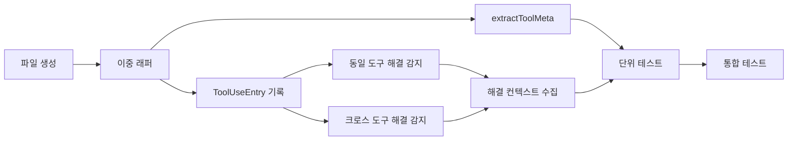

# 작업 목록: tool-logger

## 개요

- 총 작업 수: 10개
- 예상 복잡도: 높음

---

## 작업 목록

### Phase 1: 기반 구축

- [ ] [P1] `hooks/tool-logger.mjs` 파일 생성 및 db.mjs, error-kb import 설정
- [ ] [P1] try-catch 이중 래퍼 구조 작성 (외부: 전체, 내부: 해결 감지)

### Phase 2: 핵심 구현

- [ ] [P2] `isEnabled()` 체크 추가 — 훅 진입점에서 `if (!isEnabled()) process.exit(0)` 호출 (모든 훅 필수 패턴)
- [ ] [P2] ToolUseEntry 스키마 구성 및 `insertEvent()` 호출 — `v`, `type`, `ts`, `sessionId`, `project`, `projectPath`, `tool`, `meta`, `success`
- [ ] [P2] `extractToolMeta()` 구현 — 7개 case: Bash: `{ cmd: firstWord }`, Read: `{ file: toolInput.file_path }`, Write: `{ file: toolInput.file_path }`, Edit: `{ file: toolInput.file_path }`, Grep: `{ pattern: toolInput.pattern }`, Glob: `{ pattern: toolInput.pattern }`, Task: `{ agentType: toolInput.subagent_type, model: toolInput.model }`, default: `{}`
- [ ] [P2] 민감 파일 경로 마스킹 구현 — `.env`, `.env.*`, `credentials.json`, `*.key`, `*.pem`, `id_rsa*` 패턴을 `[SENSITIVE_PATH]`로 치환 (spec REQ-DC-202). NOTE: DESIGN.md 참조 구현(L903-925)에는 민감 파일 마스킹 로직이 없음. spec REQ-DC-202에서 요구하는 확장 기능
- [ ] [P2] 동일 도구 해결 감지 구현 — 최근 50개 엔트리에서 세션 내 동일 도구 에러 → 성공 패턴 감지 + `recordResolution` 호출 (DESIGN.md L830). recordResolution 호출 시 첫 번째 인자는 `lastError.error` (이미 normalizeError() 적용된 정규화 에러), 두 번째는 `{ errorRaw, resolvedBy: toolName, toolSequence }`
- [ ] [P2] 크로스 도구 해결 감지 구현 — 다른 도구 에러가 현재 도구의 도움으로 해결된 패턴 감지
- [ ] [P2] 해결 컨텍스트 수집 — `toolSequence` (에러-성공 사이 최대 5개), `promptContext` (마지막 프롬프트 200자), `filePath`

### Phase 3: 마무리

- [ ] [P3] [->T] 단위 테스트 — extractToolMeta 7개 도구 유형, Bash 첫 단어 추출, 민감 경로 마스킹 6종 패턴
- [ ] [P3] [->T] 통합 테스트 — 동일 도구/크로스 도구 해결 감지 시나리오, 해결 감지 실패 시 정상 종료, 50개 이벤트 제한

---

## 의존성 그래프

---

## 마커 범례

| 마커 | 의미 |
|------|------|
| [P1-3] | 우선순위 |
| [->T] | 테스트 필요 |
| [US] | 불확실/검토 필요 |
