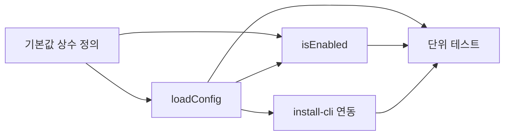

# 작업 목록: config-schema

## 개요

- 총 작업 수: 8개
- 예상 복잡도: 낮음

---

## 작업 목록

### Phase 1: 기본값 상수 정의

- [ ] [P1] `lib/db.mjs` 상단에 config 관련 기본값 상수 정의. NOTE: DESIGN.md에서 db.mjs에 정의된 상수는 4개(`GLOBAL_DIR`, `DATA_DIR`, `DB_PATH`, `RETENTION_DAYS`)뿐. 나머지 설정값은 `config.json` 스키마의 기본값으로만 존재하며, `loadConfig()`를 통해 런타임에 접근
- [ ] [P1] `GLOBAL_DIR` 경로 상수 확인 및 config.json 경로 구성 검증

### Phase 2: loadConfig/isEnabled 구현

- [ ] [P2] `loadConfig()` 구현 — `existsSync` + `readFileSync` + `JSON.parse`, try-catch로 파싱 에러 시 `{}` 반환
- [ ] [P2] `isEnabled()` 구현 — `loadConfig()` 호출 후 `config.enabled !== false` 반환

### Phase 3: install-cli 연동

- [ ] [P3] `bin/install.mjs`에서 config.json 초기 생성 — 최소 필드(`enabled`, `collectPromptText`, `retentionDays`, `analysisModel`) + `existsSync` 보호

### Phase 4: 테스트

- [ ] [P4] [->T] `loadConfig()` 단위 테스트 — 정상 로딩, 파일 미존재, 파싱 에러 3개 시나리오
- [ ] [P4] [->T] `isEnabled()` 단위 테스트 — `enabled: false`, `enabled: true`, 필드 미지정 3개 시나리오
- [ ] [P4] [->T] 기본값 병합 테스트 — 부분 설정 시 OR 패턴 기본값 적용 검증

---

## 의존성 그래프

---

## 마커 범례

| 마커 | 의미 |
|------|------|
| [P1-4] | 우선순위 |
| [->T] | 테스트 필요 |
