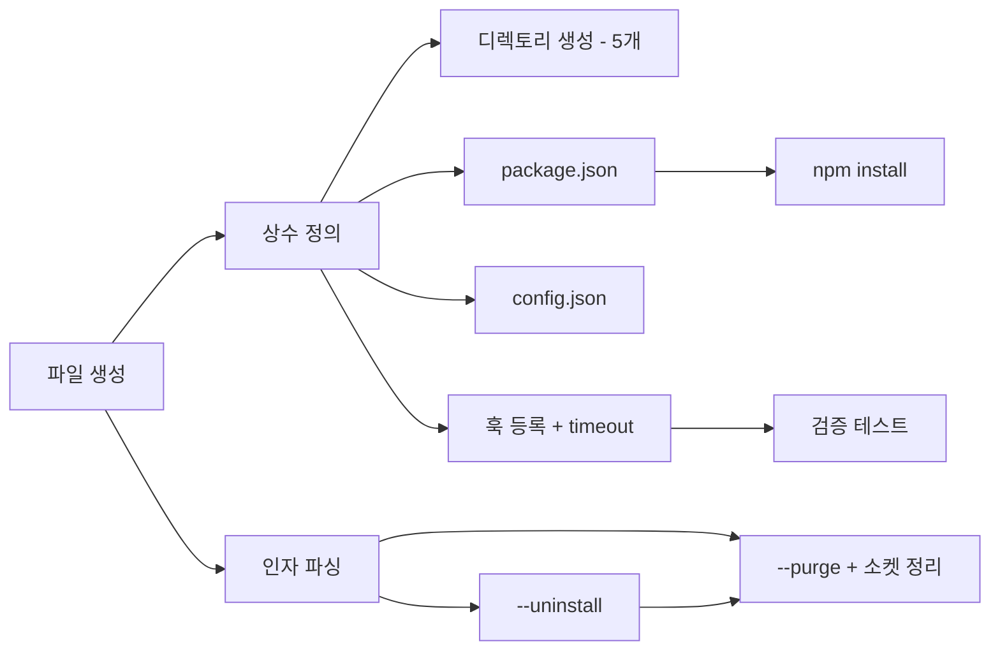

# 작업 목록: install-cli

## 개요

- 총 작업 수: 15개
- 예상 복잡도: 중간

---

## 작업 목록

### Phase 1: 기반 구축

- [ ] [P1] `bin/install.mjs` 파일 생성 및 ES Module 설정
- [ ] [P1] 상수 정의 — `SELF_GEN_DIR`, `SETTINGS_PATH`, `HOOK_EVENTS` (8개 이벤트-스크립트 매핑). timeout 필드: 일반 훅 6개 (UserPromptSubmit, PostToolUse, PostToolUseFailure, PreToolUse, SubagentStart, SubagentStop): `timeout: 5`, 세션 훅 2개 (SessionEnd, SessionStart): `timeout: 10`
- [ ] [P1] CLI 인자 파싱 — `--uninstall`, `--purge` 플래그 처리

### Phase 2: 설치 로직

- [ ] [P2] 디렉토리 구조 생성 — `['data', 'hooks', 'lib', 'bin', 'prompts']` 5개 하위 디렉토리 (`mkdirSync` recursive). `hooks/auto/`는 apply.mjs에서 동적 생성
- [ ] [P2] `package.json` 생성 — 존재 여부 확인 후 조건부 생성. 의존성: `better-sqlite3: '^11.0.0'`, `sqlite-vec: '^0.1.0'`, `@xenova/transformers: '^2.17.0'`. `version: '0.1.0'`, `type: 'module'`, `private: true`
- [ ] [P2] `npm install --production` 실행 — `execSync` + 에러 처리
- [ ] [P2] `config.json` 초기화 — 존재 여부 확인 후 조건부 생성 (기본값 4개 필드)
- [ ] [P2] `settings.json` 훅 등록 — 8개 이벤트 병합, 중복 방지, PreToolUse matcher 처리, timeout 필드 포함

### Phase 3: 제거 로직

- [ ] [P3] `--uninstall` 처리 — `.self-generation` 포함 훅 필터링 제거, 빈 배열 정리
- [ ] [P3] `--purge` 처리 — `rmSync({ recursive: true, force: true })` 데이터 삭제 + `/tmp/self-gen-embed.sock` 소켓 파일 정리. NOTE: DESIGN.md에는 --purge 구현이 없음 (spec MAY 확장). DESIGN.md L1909의 --uninstall은 훅 제거 + 안내 메시지만 출력

### Phase 4: 검증 및 테스트

- [ ] [P4] [->T] `--install` 정상 설치 테스트 — 5개 디렉토리 생성, package.json, npm install, config.json, settings.json 8개 훅 등록 확인
- [ ] [P4] [->T] `--uninstall` 훅 제거 테스트 — settings.json에서 훅만 제거, 다른 훅 보존 확인
- [ ] [P4] [->T] `--purge` 전체 삭제 테스트 — 디렉토리 삭제 + 소켓 파일 정리 확인
- [ ] [P4] [->T] 중복 실행 멱등성 테스트 — 설치 2회 실행 시 훅 중복 등록 방지 확인
- [ ] [P4] [->T] settings.json 기존 훅 보존 테스트 — 기존 훅과 병합되는지 확인

---

## 의존성 그래프

---

## 마커 범례

| 마커 | 의미 |
|------|------|
| [P1-3] | 우선순위 |
| [->T] | 테스트 필요 |
| [US] | 불확실/검토 필요 |
