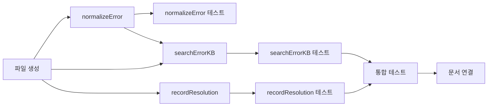

# Tasks: error-kb

## 개요

- 총 작업 수: 9개
- 예상 복잡도: 중간

---

## 작업 목록

### Phase 1: 스캐폴드

- [ ] [P1] `lib/error-kb.mjs` 파일 생성 — KB_FILE 상수, fs/path import, export 구조 설정
- [ ] [P1] `normalizeError(msg)` 구현 — PATH/N/STR 정규식 치환 + 200자 절단 + trim
- [ ] [P1] [->T] `normalizeError()` 단위 테스트 — 경로, 숫자, 문자열 치환, 200자 절단, 빈 입력

### Phase 2: 핵심 구현 (v9: 3단계 검색)

- [ ] [P1] `searchErrorKB(normalizedError)` Stage 1 — 정확 텍스트 매치 (`WHERE error_normalized = ?`), resolution NULL 필터, use_count/last_used 갱신
- [ ] [P1] `searchErrorKB(normalizedError)` Stage 2 — 접두사 매치 (앞 30자 LIKE), 길이비율 ≥0.7 검증, 미달 시 Stage 3으로
- [ ] [P1] `searchErrorKB(normalizedError)` Stage 3 — 벡터 유사도 검색 3단계 로직:
  - `generateEmbeddings()` → `vectorSearch('error_kb', 'vec_error_kb', embedding, 3)` 호출
  - **고신뢰 매칭** (distance < 0.76): 즉시 반환
  - **저신뢰 매칭** (0.76 ≤ distance < 0.85): `normalizedError`의 주요 키워드(3자 이상 단어)와 `resolution` 내 키워드 비교, 1개 이상 공통 키워드 있으면 반환, 없으면 null
  - **매칭 없음** (distance ≥ 0.85): null 반환
  - try-catch로 벡터 실패 시 null 반환
- [ ] [P1] `recordResolution(normalizedError, resolution)` 구현 — 파라미터: `normalizedError` (string), `resolution` (객체: `{ errorRaw, resolvedBy, toolSequence }`), UPSERT 패턴 (`INSERT ... ON CONFLICT(error_normalized) DO UPDATE SET ...`), 임베딩은 배치에서 처리
- [ ] [P2] [->T] `searchErrorKB()` 단위 테스트 — Stage 1 정확 매치, Stage 2 접두사+길이비율, Stage 3 벡터 검색, resolution 없는 엔트리 스킵
- [ ] [P2] [->T] `recordResolution()` 단위 테스트 — UPSERT 동작, 중복 키 충돌 시 갱신, use_count 증가

### Phase 3: 마무리

- [ ] [P2] [->T] 통합 테스트 — error-logger.mjs에서 normalizeError + searchErrorKB 호출 흐름
- [ ] [P3] 도메인 문서 연결 — realtime-assist domain.md의 "연결 스펙" 섹션 업데이트

---

## 의존성 그래프

---

## 마커 범례

| 마커 | 의미 |
|------|------|
| [P1-3] | 우선순위 |
| [->T] | 테스트 필요 |
| [US] | 불확실/검토 필요 |
