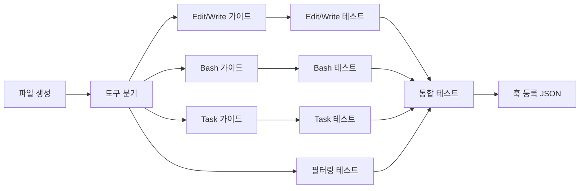

# Tasks: pre-tool-guide

## 개요

- 총 작업 수: 11개
- 예상 복잡도: 높음

---

## 작업 목록

### Phase 1: 스캐폴드 및 도구 필터링 (v9: import 정리)

- [ ] [P1] `hooks/pre-tool-guide.mjs` 파일 생성 — import (db), try-catch, isEnabled() (error-kb import 제거)
- [ ] [P1] 대상 도구 분기 구조 — Edit/Write, Bash 분기 + 그 외 즉시 종료 (Task 제거)
- [ ] [P2] [->T] 도구 필터링 테스트 — Read, Glob 등 대상 외 도구 스킵 확인, isEnabled() 비활성화 시 스킵

### Phase 2: 도구별 가이드 로직 (v9: 텍스트 검색 우선, Task 비활성화)

- [ ] [P1] `isEnabled()` 체크 로직 추가 — config.enabled === false 시 즉시 exit 0
- [ ] [P1] Edit/Write 가이드 구현 — file_path 추출 → error_kb 직접 쿼리 (`WHERE error_normalized LIKE ? AND resolution IS NOT NULL ORDER BY last_used DESC LIMIT 2`), 벡터 검색 회피
- [ ] [P1] Edit/Write resolution JSON 파싱 — try-catch로 JSON.parse, 실패 시 원본 문자열 사용
- [ ] [P1] Bash 가이드 구현 — session_id 기반 Bash tool_error 검색 (`SELECT json_extract(data, '$.error') AS error FROM events WHERE type = 'tool_error' AND session_id = ? AND json_extract(data, '$.tool') = 'Bash' ORDER BY ts DESC LIMIT 1`) → error_kb 정확 매치 직접 쿼리 (`WHERE error_normalized = ?`), 벡터 검색 회피 → resolution JSON 파싱 시도 (`resolvedBy`, `toolSequence.join(' → ')` 표시, 실패 시 원본 문자열 사용)
- [ ] [P1] Task 가이드 비활성화 처리 — v9: SubagentStop API 한계로 주석 처리, 향후 agent_transcript_path 파싱 구현 시 재활성화
- [ ] [P2] [->T] Edit/Write 가이드 테스트 — 에러 있음/없음, KB 매치 있음/없음, JSON 파싱 성공/실패 폴백
- [ ] [P2] [->T] Bash 가이드 테스트 — 세션 내 에러 있음/없음, toolSequence 표시, isEnabled() 비활성화 시 스킵
- [ ] [P2] [->T] Task 가이드 비활성화 확인 — 주석 처리된 코드 블록 확인

### Phase 3: 마무리

- [ ] [P2] [->T] 통합 테스트 — hookSpecificOutput JSON 포맷 검증 + exit 0 보장 + 복합 가이드 출력
- [ ] [P3] 훅 등록 JSON 준비 — settings.json PreToolUse 항목 문서화

---

## 의존성 그래프

---

## 외부 의존성

| 의존 피처 | 필요 함수/데이터 |
|-----------|----------------|
| error-kb | 직접 SQL 쿼리로 대체됨 (v9) |
| db | `readStdin()`, `queryEvents()`, `getDb()` |
| subagent-tracker | `events` 테이블 `subagent_stop` 타입 데이터 |

---

## 마커 범례

| 마커 | 의미 |
|------|------|
| [P1-3] | 우선순위 |
| [->T] | 테스트 필요 |
| [US] | 불확실/검토 필요 |
