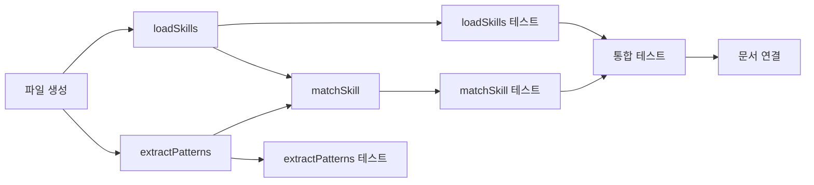

# Tasks: skill-matcher

## 개요

- 총 작업 수: 10개
- 예상 복잡도: 중간

---

## 작업 목록

### Phase 1: 스캐폴드 및 스킬 로드 (v9: 시노님맵 제거)

- [ ] [P1] `lib/skill-matcher.mjs` 파일 생성 — fs/path import, export 구조 설정 (CACHE_FILE 제거)
- [ ] [P1] `loadSkills(projectPath)` 구현 — ~/.claude/commands + <projectPath>/.claude/commands 스캔, {name, scope, content, description, sourcePath} 배열 반환
- [ ] [P2] [->T] `loadSkills()` 단위 테스트 — 전역+프로젝트 로드, 디렉토리 부재, 빈 디렉토리, description 추출

### Phase 2: 핵심 매칭 로직 (v9: 벡터 우선, 시노님맵 제거)

- [ ] [P1] `extractPatterns(content)` 구현 — "감지된 패턴" 섹션 파싱, - 접두사 항목 추출, 따옴표 제거
- [ ] [P1] `matchSkill(prompt, skills)` Stage 1 — 벡터 유사도 검색 (`generateEmbeddings()` → `vectorSearch('skill_embeddings', 'vec_skill_embeddings', embedding, 1)` → distance < 0.76)
- [ ] [P1] `matchSkill(prompt, skills)` Stage 2 — 키워드 폴백 (`keywordMatch()` — 50% 이상, 3자 이상 단어, toLowerCase 비교)
- [ ] [P1] `keywordMatch(prompt, skills)` 내부 함수 구현 — extractPatterns 활용, 패턴 키워드 50%+ 매칭
- [ ] [P1] `refreshSkillEmbeddings(projectPath)` 구현 (REQ-RA-103) — loadSkills → mtime 비교 → 변경된 스킬만 generateEmbeddings → skill_embeddings UPSERT + vec_skill_embeddings 갱신 (NOTE: DESIGN.md에는 이 함수의 참조 구현이 없음. batch-embeddings.mjs(DESIGN.md L1477-1493)에 inline으로 존재하는 로직을 독립 함수로 추출. spec REQ-RA-103 기반으로 구현)
- [ ] [P2] [->T] `extractPatterns()` 단위 테스트 — 패턴 섹션 있음/없음, 빈 파일
- [ ] [P2] [->T] `matchSkill()` 단위 테스트 — 벡터 매칭 우선, 키워드 폴백, 교차 언어 매칭 (한→영, 영→한), 임계값 미달, 대소문자 무관
- [ ] [P2] [->T] `refreshSkillEmbeddings()` 단위 테스트 — mtime 기반 증분 갱신, 변경 없을 때 스킵

### Phase 3: 마무리

- [ ] [P2] [->T] 통합 테스트 — prompt-logger.mjs에서 loadSkills + matchSkill 호출 흐름
- [ ] [P3] 도메인 문서 연결 — realtime-assist domain.md의 "연결 스펙" 섹션 업데이트

---

## 의존성 그래프

---

## 마커 범례

| 마커 | 의미 |
|------|------|
| [P1-3] | 우선순위 |
| [->T] | 테스트 필요 |
| [US] | 불확실/검토 필요 |
