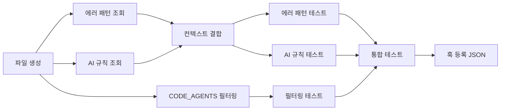

# Tasks: subagent-context

## 개요

- 총 작업 수: 10개
- 예상 복잡도: 중간

---

## 작업 목록

### Phase 1: 스캐폴드 및 에이전트 필터링 (v9: import 정리)

- [ ] [P1] `hooks/subagent-context.mjs` 파일 생성 — import (db, ai-analyzer), CODE_AGENTS 상수, try-catch, isEnabled()
- [ ] [P1] CODE_AGENTS 필터링 로직 — agent_type.includes() 매칭, 비코드 에이전트 즉시 exit 0
- [ ] [P2] [->T] 에이전트 필터링 테스트 — 코드 에이전트, 비코드 에이전트, 복합 타입명 (oh-my-claudecode:executor-high), isEnabled() 비활성화 시 스킵

### Phase 2: 컨텍스트 주입 로직 (v9: 텍스트 검색 우선)

- [ ] [P1] `isEnabled()` 체크 로직 추가 — config.enabled === false 시 즉시 exit 0
- [ ] [P1] 프로젝트별 에러 패턴 조회 — queryEvents({type: 'tool_error', projectPath, limit: 3}) → error_kb 테이블 정확 매치 직접 쿼리 (`WHERE error_normalized = ?`), 벡터 검색 회피
- [ ] [P1] AI 분석 규칙 조회 — getCachedAnalysis(48, project) (project 파라미터 추가) → claude_md 타입 + 프로젝트 필터 → 최대 3건 추출
- [ ] [P1] resolution 150자 절단 처리 — `.slice(0, 150)` 적용
- [ ] [P1] 컨텍스트 결합 및 500자 절단 — parts.join('\n').slice(0, 500) → stdout JSON 출력
- [ ] [P2] [->T] 에러 패턴 주입 테스트 — 에러 있음/없음, KB 정확 매치 있음/없음, 150자 절단 동작
- [ ] [P2] [->T] AI 규칙 주입 테스트 — 캐시 유효/만료/없음, project 파라미터 전달, 프로젝트 필터링

### Phase 3: 마무리

- [ ] [P2] [->T] 통합 테스트 — hookSpecificOutput JSON 포맷 + 500자 절단 + 빈 컨텍스트 무출력 + exit 0 보장
- [ ] [P3] 훅 등록 JSON 준비 — settings.json SubagentStart 항목 문서화

---

## 의존성 그래프

---

## 외부 의존성

| 의존 피처 | 필요 함수/데이터 |
|-----------|----------------|
| error-kb | 직접 SQL 쿼리로 대체됨 (v9) |
| ai-analyzer | `getCachedAnalysis()` |
| db | `readStdin()`, `queryEvents()`, `getDb()`, `getProjectName()` |

---

## 마커 범례

| 마커 | 의미 |
|------|------|
| [P1-3] | 우선순위 |
| [->T] | 테스트 필요 |
| [US] | 불확실/검토 필요 |
