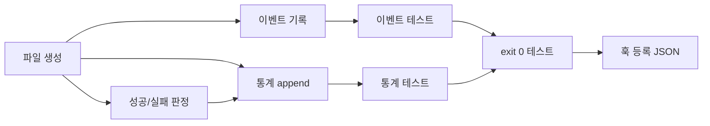

# Tasks: subagent-tracker

## 개요

- 총 작업 수: 8개
- 예상 복잡도: 낮음

---

## 작업 목록

### Phase 1: 스캐폴드 및 이벤트 기록 (v9: 간소화)

- [ ] [P1] `hooks/subagent-tracker.mjs` 파일 생성 — import, try-catch 구조, readStdin(), isEnabled()
- [ ] [P1] SubagentStopEntry를 `events` 테이블에 insertEvent() — v=1, type='subagent_stop', ts, sessionId, project, projectPath, data={agentId, agentType} (success 필드 제거)
- [ ] [P2] [->T] 이벤트 기록 단위 테스트 — 정상 입력, 필드 누락, 비정상 JSON, isEnabled() 비활성화 시 스킵

### Phase 2: 성능 통계 집계 (v9: success 필드 제거)

- [ ] [P1] `isEnabled()` 체크 로직 추가 — config.enabled === false 시 즉시 exit 0
- [ ] [P2] [->T] 통계 기록 단위 테스트 — subagent_stop 타입 기록, 파일 자동 생성
- [ ] [P3] v9 변경사항 노트 작성 — "success 필드는 SubagentStop API 한계로 제거됨. 향후 agent_transcript_path 파싱으로 정확한 판정 구현 예정"

### Phase 3: 마무리

- [ ] [P2] [->T] exit 0 보장 테스트 — stdin 파싱 실패, 파일 쓰기 실패, 빈 입력
- [ ] [P3] 훅 등록 JSON 준비 — settings.json SubagentStop 항목 문서화

---

## 의존성 그래프

---

## 마커 범례

| 마커 | 의미 |
|------|------|
| [P1-3] | 우선순위 |
| [->T] | 테스트 필요 |
| [US] | 불확실/검토 필요 |
