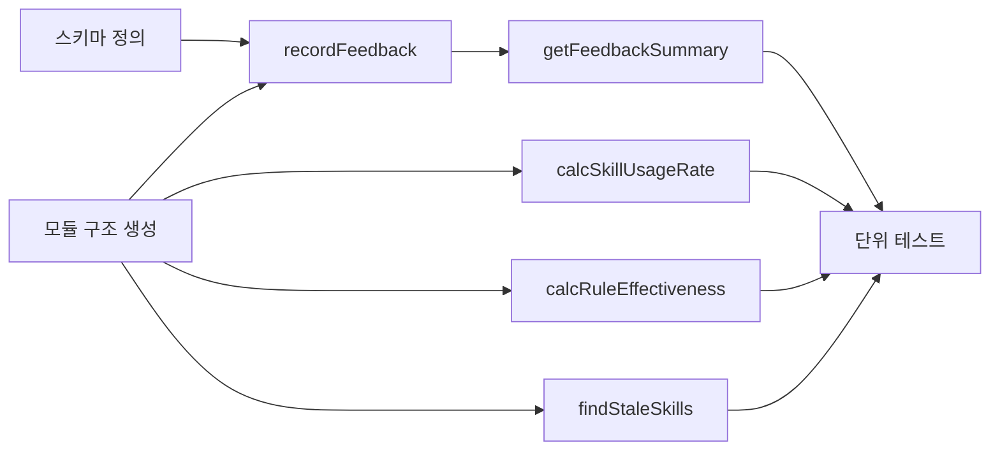

# 작업 목록: feedback-tracker

> 총 8개 작업

---

## 진행 상황

- 대기: 8
- 진행 중: 0
- 완료: 0
- 차단됨: 0

---

## 작업 목록

### Phase 1: 스캐폴딩

- [ ] [P1] `lib/feedback-tracker.mjs` 모듈 구조 생성 — import문 (`getDb()` from `./db.mjs`), 상수 (`DATA_DIR`), export 선언 (v8 SQLite 전환으로 `FEEDBACK_FILE` 상수 제거)
- [ ] [P1] `feedback` 테이블 스키마 정의 — `{ v: 1, ts, suggestionId, action, suggestionType?, summary? }` 문서화

### Phase 2: 핵심 구현

- [ ] [P2] `recordFeedback(id, action, details)` 구현 — `recordFeedback()`로 SQLite `feedback` 테이블에 INSERT, `v: 1` + `ts` 자동 생성
- [ ] [P2] `getFeedbackSummary()` 구현 — `db.prepare('SELECT * FROM feedback ORDER BY ts ASC').all()` — **feedback 테이블 전체 조회** (JSONL 파일 아님), 채택/거부 집계, 채택률 계산, 최근 10건 슬라이스, 보조 메트릭 포함, 반환: `{ total, acceptedCount, rejectedCount, rate, recentRejections, recentAcceptances, skillUsageRate, ruleEffectiveness, staleSkills }`
- [ ] [P2] `calcSkillUsageRate()` 구현 — `events` 테이블에서 `skill_used` / `skill_created` 비율 계산
- [ ] [P2] `calcRuleEffectiveness()` 구현 — `events` 테이블에서 `tool_error` 전체/최근 7일 집계
- [ ] [P2] `findStaleSkills(days)` 구현 — 스킬 목록 로드, `skill_used` 이벤트 대조, 미사용 스킬 배열 반환

### Phase 3: 테스트

- [ ] [P3] [->T] 전체 함수 단위 테스트 — recordFeedback(3 시나리오), getFeedbackSummary(3 시나리오), calcSkillUsageRate(3 시나리오), calcRuleEffectiveness(2 시나리오), findStaleSkills(3 시나리오)

---

## 의존성 그래프

---

## 마커 범례

| 마커 | 의미 |
|------|------|
| [P1-3] | 우선순위 |
| [->T] | 테스트 필요 |
| [US] | 불확실/검토 필요 |
