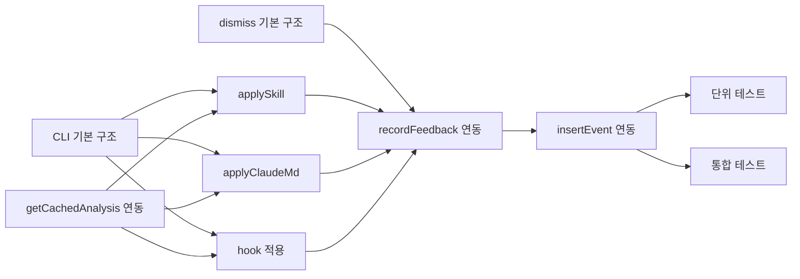

# 작업 목록: suggestion-cli

> 총 10개 작업

---

## 진행 상황

- 대기: 10
- 진행 중: 0
- 완료: 0
- 차단됨: 0

---

## 작업 목록

### Phase 1: 스캐폴딩

- [ ] [P1] `bin/apply.mjs` 기본 구조 생성 — CLI 인자 파싱(`process.argv`), `--global`/`--apply` 플래그 처리, `--project <name>` 플래그 처리 (미지정 시 `basename(process.cwd())`), `getCachedAnalysis(168, project)` — **168시간 = 7일** TTL, 사용법 안내 출력
- [ ] [P1] `bin/dismiss.mjs` 기본 구조 생성 — CLI 인자 파싱, suggestion ID 검증, 사용법 안내 출력
- [ ] [P1] `ai-analyzer`의 `getCachedAnalysis()` import 연동 — 캐시 조회 및 7일 유효성 검증 로직

### Phase 2: 핵심 구현

- [ ] [P2] `applySkill()` 함수 구현 — `.claude/commands/<skillName>.md` 파일 생성, `--global` 분기, 디렉터리 재귀 생성, 스킬 마크다운 템플릿
- [ ] [P2] `applyClaudeMd()` 함수 구현 — CLAUDE.md 규칙 추가, 중복 검사(`content.includes(rule)`), `## 자동 감지된 규칙` 섹션 자동 생성
- [ ] [P2] hook 적용 로직 구현 — `hooks/auto/workflow-<id>.mjs` 생성, `--apply` 시 `settings.json` 읽기→병합→쓰기, hookCode 미포함 시 경고
- [ ] [P2] `recordFeedback()` 연동 — apply 성공 시 `'accepted'`, dismiss 시 `'rejected'` 기록
- [ ] [P2] `insertEvent()` 이벤트 추적 — apply 성공 시 `skill_created` (스킬 유형) 또는 `suggestion_applied` (claude_md/hook 유형) 이벤트를 events 테이블에 기록, `insertEvent({ type: 'skill_created', ..., data: { skillName, suggestionId } })` 패턴 (REQ-SE-007)

### Phase 3: 테스트

- [ ] [P3] [->T] 단위 테스트 작성 — `applySkill`, `applyClaudeMd`, hook 적용 각 함수별 테스트 (정상/에러 케이스)
- [ ] [P3] [->T] 통합 테스트 작성 — apply.mjs, dismiss.mjs 전체 흐름 E2E 테스트 (캐시 조회→적용→피드백 기록)

---

## 의존성 그래프

---

## 마커 범례

| 마커 | 의미 |
|------|------|
| [P1-3] | 우선순위 |
| [->T] | 테스트 필요 |
| [US] | 불확실/검토 필요 |
